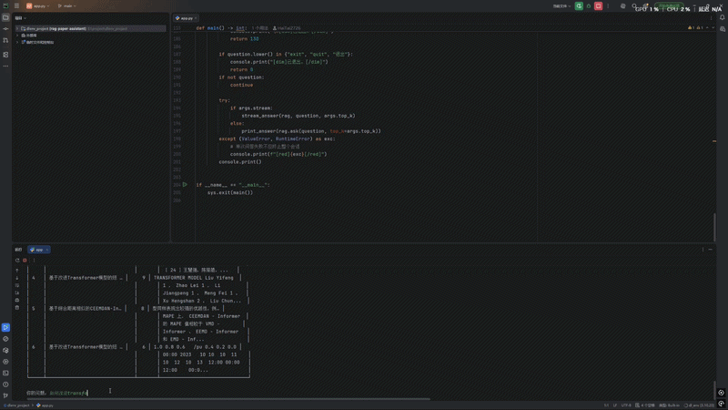

# RAG-Paper-Assistant · 基于大模型的学术文献智能问答系统

> 用自然语言检索本地论文库，答案带原文出处标注 —— 面向科研文献精读场景



<!-- ⭐ 待补：用 ScreenToGif 录 20 秒的问答过程，放到 docs/demo.gif（压到 3 MB 内） -->

---

## 它解决什么问题

做光伏功率预测方向的毕设，需要横向对比十几篇论文的方法差异。
想确认"某篇论文到底用了什么评价指标"或"它在数据预处理上有什么特殊处理"，
通常要来回翻十几页 PDF；而把整篇论文直接丢给大模型，既超出上下文长度，
又容易让它编造原文没有的内容。

本项目把论文库切分、向量化后用语义检索定位相关段落，再让大模型**只依据这些段落**作答，
并在答案里标注每条结论出自哪篇文献的第几页 —— 同时解决"能不能查到"和"敢不敢信"两个问题。

**真实使用场景**：本仓库的 `papers/` 目录即为本人的毕设文献库
（6 篇光伏功率预测方向论文，共 67 页、429 个文本块）。

### 隐私安全

核心数据处理全部在本地完成 —— 文献解析、分片、嵌入、向量检索都在本机执行，
**论文原文从不上传到任何第三方服务**。只有最终拼装好的少量文本片段（约 4000 字）
会随问题一起发给大模型 API。私有文献、未发表成果不会外泄。

---

## 效果（均为本机实测，可复现）

### 端到端质量指标

评测集：`eval/questions.jsonl`，15 题（事实型 7 / 对比型 4 / 无法回答型 4），
覆盖全部 6 篇文献。

| 指标 | 数值 | 定义 |
|---|---|---|
| **检索命中率 Recall@8** | **100%** | 正确出处是否出现在检索结果中 |
| **出处准确率** | **80.0%** | 答案引用的来源与预期一致 |
| **拒答准确率** | **100%** | 文献中无答案时，正确回答"未提及" |
| **幻觉率** | **0%** | 编造文献外内容的比例 |
| **整体通过率** | **93.3%** | 综合判定通过的比例 |
| 平均延迟 | 18.2 s | 端到端（含检索 + 大模型生成） |
| P95 延迟 | 40.5 s | 95 分位 |

> **一键复现**：
> ```bash
> python eval/run_eval.py --top-k 8 --report eval/report.md    # 完整指标
> python eval/run_eval.py --retrieval-only --top-k 8            # 只算检索（不需要 API Key）
> ```

### 检索深度消融实验

`top_k` 是唯一需要权衡的超参：召回更多块能提升命中率，但会增加上下文长度与延迟。

| top_k | 检索命中率 | 出处准确率 | 整体通过率 | 平均延迟 | P95 延迟 |
|---|---|---|---|---|---|
| 1 | 63.6% | — | — | — | — |
| 2 | 72.7% | — | — | — | — |
| 4 | 72.7% | 66.7% | 73.3% | 11.3 s | 22.3 s |
| **8（默认）** | **100%** | **80.0%** | **93.3%** | 18.2 s | 40.5 s |
| 12 | 100% | — | — | — | — |

**结论**：`top_k=8` 是性价比拐点 —— 命中率从 72.7% 提升到 100%，
整体通过率从 73.3% 提升到 93.3%，代价是平均延迟从 11.3 s 增加到 18.2 s。
对文献精读场景（准确性优先于响应速度）这个取舍是划算的；
若追求交互速度可设 `RETRIEVE_TOP_K=4`。

### 修复索引缺陷带来的提升

原始实现用 `if not os.path.exists(CHROMA_DB_DIR)` 判断是否建索引，
**目录一旦存在就永远跳过重建**。结果是往 `papers/` 加了新论文后，
新论文永远不会被嵌入，检索也永远查不到 —— 而且没有任何报错。

| 指标 | 修复前 | 修复后 |
|---|---|---|
| 向量库文本块数 | 152 | **429** |
| 覆盖文献数 | 2 / 6 | **6 / 6** |
| 未索引文献 | 4 篇静默丢失 | 0 |
| 新增论文后 | 需手动删库 | 自动增量索引（文件指纹比对） |

> 复现：`python app.py --status`

### 文本清洗带来的质量提升

PDF 解析器会在中文标点前后插入空格（实测 `proposed ， including`、`数据集 、 特征`），
图表坐标轴还会被解析成控制字符（如 `\x06\n\x04 \x04`）。这些噪声会污染嵌入向量，
实测甚至让一条纯图表碎片排到了"最相关片段"第一位。

| 指标 | 清洗前 | 清洗后 |
|---|---|---|
| 文本块数 | 446 | 429（过滤 17 个低质块） |
| 字符数（3 篇抽样） | 97,235 | 89,849（**-7.6%**） |
| 空格数（3 篇抽样） | 21,249 | 13,938（**-34%**） |
| 检索结果含控制字符 | 是 | **否** |

### MMR 重排带来的来源多样性

纯相似度检索的问题：同一段落的相邻分片会挤占全部检索名额。
实测 5 个问题的对比（`top_k=4`）：

| 问题 | 相似度检索<br>不同来源数 | MMR 检索<br>不同来源数 |
|---|---|---|
| 时频域分解 Transformer 怎么做预测？ | 1 | **3** |
| 数据预处理的共同做法？ | 1 | **2** |
| CEEMDAN-Informer 用了什么指标？ | 1 | **2** |
| ICEEMDAN-BiGRU-XGBoost 模型特点？ | 1 | **2** |
| NWP 相似日怎么选相似日？ | 2 | 2 |

> 纯相似度检索有 4/5 的问题只召回单一文献来源，MMR 平均提升到 2.25 个来源。

---

## 快速开始

```bash
# 1. 安装依赖（版本已锁定，可直接复现）
pip install -r requirements.txt

# 2. 配置 API Key
copy .env.example .env      # Linux/macOS: cp .env.example .env
# 编辑 .env，填入 DEEPSEEK_API_KEY

# 3. 放入论文（支持 PDF / DOCX / TXT / Markdown）
#    把 PDF 放进 papers/ 目录

# 4. 运行
python app.py --status                      # 查看索引覆盖情况
python app.py                               # 交互式问答
python app.py -q "TCN-BiLSTM 的创新点是什么"   # 单次提问
python app.py -q "用了什么评价指标" --stream    # 流式输出
```

**常用命令**

| 命令 | 作用 |
|---|---|
| `python app.py --status` | 查看向量库覆盖了哪些文献（诊断"文献没被索引"） |
| `python app.py --sync` | 增量同步索引后退出（新增论文后运行） |
| `python app.py --rebuild` | 全量重建索引（换了嵌入模型或改了分片参数后用） |
| `python app.py -q "..."` | 单次提问，适合脚本调用 |
| `python app.py -q "..." --stream` | 流式输出，打字机效果 |

**无显卡也能跑**：`DEVICE=auto` 会自动探测 CUDA，无需改代码。

---

## 技术方案

```
                     ┌────────────────┐
   papers/*.pdf ────▶ │   loader.py    │  多格式解析 + 中文排版清洗 + 低质页过滤
   papers/*.docx      └────────┬───────┘
                               ▼
                     ┌────────────────┐
                     │  splitter.py   │  中文标点优先的递归分片（500 / 50）
                     └────────┬───────┘
                               ▼
                     ┌────────────────┐
                     │ bge-large-zh   │  归一化嵌入（BGE 官方要求）
                     └────────┬───────┘
                               ▼
                     ┌────────────────┐
                     │  ChromaDB      │  余弦距离 + 文件指纹增量索引
                     └────────┬───────┘
                               ▼  MMR 重排检索（k=8, fetch_k=20, λ=0.5）
   question ─────────▶ ┌────────────────┐
                       │     qa.py      │  组装 [片段N] 编号上下文
                       └────────┬───────┘
                               ▼
                       ┌────────────────┐
                       │  DeepSeek API  │  受限提示词，强制标注出处
                       └────────┬───────┘
                               ▼
                    答案 + [片段N] 出处标注 + 延迟统计
```

### 四个关键设计决策

**1. 中文标点优先的分隔符表**（`src/splitter.py`）

LangChain 默认分隔符只有 `["\n\n", "\n", " ", ""]`，用在中文上会切出残缺片段。
实测（`chunk_size=60`，句末标点明确的合成文本）：

| 分隔符配置 | 内容全由完整句子组成的块 | 残缺片段 |
|---|---|---|
| 中文标点优先（本项目） | **10/10 = 100%** | **0/40 = 0%** |
| 英文默认 | 0/10 = 0% | 18/49 = 37% |

> ⚠️ 一个容易搞错的地方：`keep_separator=True`（默认值）会把分隔符挂到
> **下一块的开头**，而非留在当前块尾。实测 `chunk_size=60` 时块尾是句末标点的
> 比例是 0%，块首才是"。"。所以**不要**用"块尾是否为句号"判断分片质量。

**2. 检索用 MMR 而非纯相似度**（`src/qa.py`）

见上文实测表。`fetch_k=20` 是重排前的候选池，必须显著大于 `k` ——
若 `fetch_k == k`，MMR 会退化成普通相似度检索。

**3. 嵌入向量做 L2 归一化**（`src/vectorstore.py`）

BGE 系列用余弦相似度检索，不归一化会让长文本因向量模长偏大而虚高相似度。
这是 BGE 官方文档的明确要求，也是常见踩坑点。同时集合用 `hnsw:space=cosine`。

**4. 用文件指纹做增量索引**（`src/vectorstore.py`）

对比库中已索引文件的 `size + mtime` 指纹与磁盘现状，只嵌入新增/变更的文件，
并清理已删除文件的残留向量。既修掉漏索引，又避免每次启动全量重建。
选择 `size + mtime` 而非完整哈希：对几十 MB 的 PDF，逐字节哈希每次启动要多花数秒。

---

## 项目结构

```
dlenv_project/
├── app.py                  # CLI 入口（交互 / 单次提问 / 流式 / 状态查询）
├── config.py               # 全局配置（显式 .env 路径 + 启动校验）
├── prompts/
│   └── qa_prompt.txt       # 提示词独立文件，可 diff、可 A/B 对比
├── src/
│   ├── loader.py           # 多格式加载 + 中文清洗 + 低质页过滤
│   ├── splitter.py         # 中文优化的递归分片
│   ├── vectorstore.py      # Chroma 封装 + 指纹增量索引
│   ├── qa.py               # RAG 编排（LCEL）+ 结构化返回
│   └── logger.py           # 统一日志（替代 print）
├── eval/
│   ├── questions.jsonl     # 评测集：15 题，三类问题
│   └── run_eval.py         # 一键评测，输出 Recall@K / 拒答率 / P95
├── tests/                  # 单元测试：132 项，不依赖 API Key 与真实 PDF
├── .github/workflows/ci.yml
├── requirements.txt        # 运行依赖（已锁版本）
└── requirements-dev.txt    # 开发依赖（ruff / pytest / pre-commit）
```

---

## 评测方法

```bash
# 完整评测（需要 API Key）
python eval/run_eval.py --top-k 8 --report eval/report.md --json eval/report.json

# 只算检索指标（不需要 API Key，秒级完成）
python eval/run_eval.py --retrieval-only

# 消融实验：验证 top_k 的影响（README 表格的数据来源）
python eval/run_eval.py --retrieval-only --top-k 1
python eval/run_eval.py --retrieval-only --top-k 8
```

评测集分三类，其中"无法回答型"专门测幻觉控制：

| 类型 | 数量 | 判定标准 |
|---|---|---|
| `fact` 事实型 | 7 | 检索命中预期出处 **且** 给出含预期关键词的实质回答 |
| `compare` 对比型 | 4 | 回答未拒答 **且** 命中预期出处 |
| `absent` 无法回答型 | 4 | **拒答即通过**，编造内容即失败 |

**拒答判定采用三重规则**（`eval/run_eval.py`）：

1. 出现"未提及/未涉及/无法回答"等关键词；
2. 回答长度不超过 150 字符；
3. **不出现转折词**（"不过/但是/一般来说/通常/建议"等）。

第 3 条是必要的：模型常说"文献未提及。不过一般来说光伏电站通常……"——
前半句拒答、后半句开编。只看关键词会把这种回答算成成功拒答，让幻觉率虚低。

---

## 测试

```bash
pip install -r requirements-dev.txt

pytest -q                        # 单元测试，12 秒，不需要 API Key
pytest -q --run-integration      # 含真实 PDF 解析与真实 Chroma（约 75 秒）
pytest -q --cov=src              # 覆盖率报告
ruff check .                     # 静态检查
ruff format --check .            # 格式检查
pre-commit install               # 装 Git 钩子，提交前自动检查
```

| 项目 | 结果 |
|---|---|
| 单元测试 | **132 通过**，3 跳过（`integration` 标记） |
| 集成测试 | **135 通过**（真实 PDF + 真实 Chroma 增量同步） |
| 覆盖率 | **82%**（loader 96% / vectorstore 89% / splitter 100% / logger 100% / qa 53%） |
| ruff check | 全部通过 |
| ruff format | 全部合规 |

测试设计原则：**不依赖 API Key、不依赖嵌入模型、不依赖真实 PDF**，
因此 CI 里能秒级跑完。重点守护两条容易出错的不变量：
增量索引的四个分支（新增/未变/变更/删除）与中文分片的句子完整性。

---

## 排查常见问题

| 现象 | 原因与处理 |
|---|---|
| 提示 `未配置 DEEPSEEK_API_KEY` | 没有 `.env` 文件。复制 `.env.example` 为 `.env` 并填 Key |
| 报 `401 Authentication Fails` | API Key 无效或已过期，到 DeepSeek 平台重新生成 |
| 提问查不到某篇论文 | 运行 `python app.py --status` 看该文献是否被索引；未索引则 `--sync` |
| 索引覆盖数少于 papers 里的文件数 | 该 PDF 可能是扫描件（无文字层），需先 OCR |
| 中文日志乱码 | 日志文件已强制 UTF-8；Windows 控制台可执行 `chcp 65001` |
| 答案没有 `[片段N]` 标注 | 模型未遵循提示词。可提高 `temperature` 或加强 `prompts/qa_prompt.txt` 的措辞 |

---

## 已知限制与后续计划

**当前限制**

- 扫描版 PDF（无文字层）无法解析，需先做 OCR
- 表格与公式提取质量有限，公式常被解析成散乱符号
- 单轮问答，不支持多轮追问中的指代消解
- 评测集为单人标注（15 题），`compare` 类判定依赖关键词匹配，存在主观性
- 延迟偏高（平均 18.2 s）：`top_k=8` 的上下文较长，且未做流式渲染优化
- 仍依赖 `langchain-community`（官方已标记 sunset），后续需迁移到独立集成包

**后续计划**

- [ ] FastAPI 接口层 + SSE 流式输出
- [ ] Streamlit 前端，提供在线 Demo
- [ ] Docker Compose 一键部署
- [ ] 混合检索（BM25 + 向量）提升专有名词召回
- [ ] 把评测集扩充到 50 题，降低指标波动
- [ ] 迁移到 `langchain-huggingface` + `langchain-chroma` 独立包

---

## License

MIT ｜ 论文版权归各原作者所有，本仓库不包含论文原文
